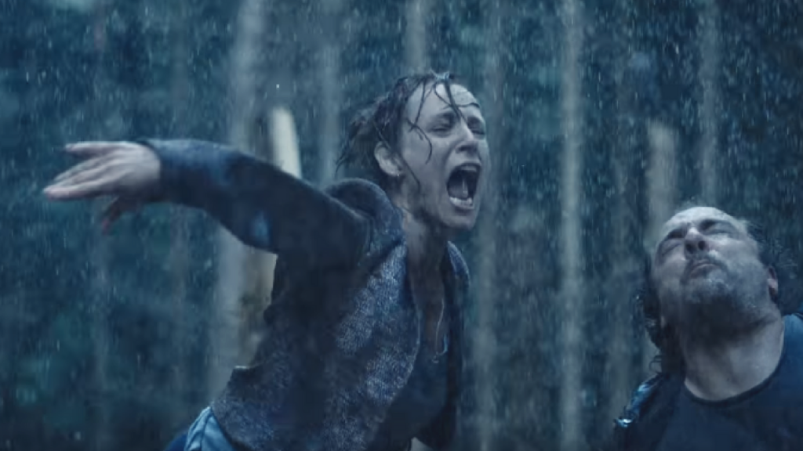
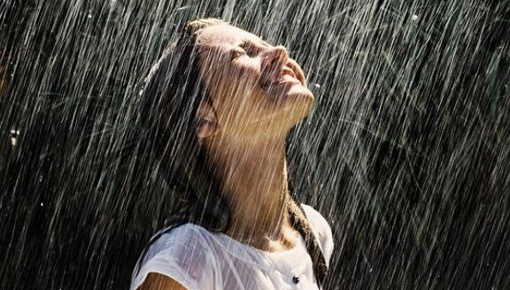
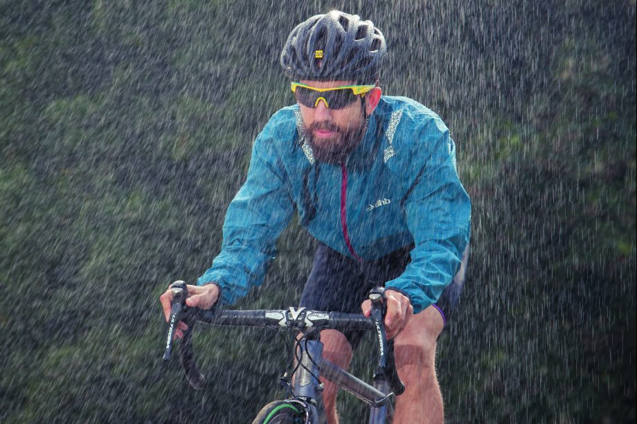
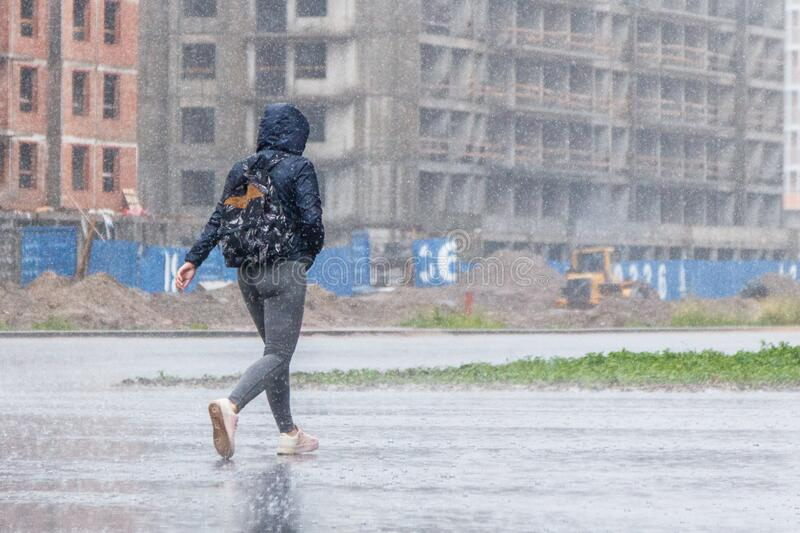

# RainDirection-and-Real3000-Dataset
This repository contains an introduction and links to RainDirection and Real3000 datasets for paper "Unpaired Learning for Deep Image Deraining with Rain Direction Regularizer".  *Authors: Yang Liu, Ziyu Yue ,Jinshan Pan, Zhixun Su, Dalian University of Technology and Nanjing University of Science and Technology*.
This work was published in the  IEEE International Conference on Computer Vision 2021(ICCV2021). You can get the paper from [here](https://openaccess.thecvf.com/content/ICCV2021/html/Liu_Unpaired_Learning_for_Deep_Image_Deraining_With_Rain_Direction_Regularizer_ICCV_2021_paper.html).
# Data overview
We are making available a new rainy dataset **RainDirection** with the direction information of rain streak and a new real world rainy dataset **Real3000**. You can download **RainDirection** and **Real3000** dataset from this [BaiduYun link](https://pan.baidu.com/s/1x4TuEDfTDCiZgqIKqXWnQg) (Extract code: 0113).
## RainDirection
The RainDirection dataset is a synthetic rainy dataset. The rainy images in RainDirection are obtained by adding clean images from Flick2K and DIV2K dataset with synthetic labeled rain maps according to the rain model *O(x) = B(x)* + *R(x)*. Each rainy image is assigned with a direction label, the horizontal Angle of the image is zero to the right and increases the angle counterclockwise. These direction labels are used to calculate the direction loss during training.  We selected images in the folder named DIV2K_val (100 images in total) and the last 430 images from Flickr2K for validation and testing, and from these we randomly selected 200 for testing and the rest for validation. We randomly selected test data can be found in the test folder.  

  
    

    

  
    
The folder structure is as follows:    
  
  
    rainy_direction_dataset
      rainy_div2k
          direction
              direction.txt
              direction.mat
          latent
              0001.png
              0002.png
              ...
              ...
              0800.png
          rainy
              0001.png
              0002.png
              ...
              ...
              0800.png
          streak
              0001.png
              0002.png
              ...
              ...
              0800.png

      rainy_flickr2k
          direction
              direction.txt
              direction.mat
          latent
              000001.png
              000002.png
              ...
              ...
              002650.png
          rainy
              000001.png
              000002.png
              ...
              ...
              002650.png
          streak
              000001.png
              000002.png
              ...
              ...
              002650.png
    
    rainy_div2k_val
          direction
              direction.txt
              direction.mat
          latent
              0801.png
              0802.png
              ...
              ...
              0900.png
          rainy
              0801.png
              0802.png
              ...
              ...
              0900.png
          streak
              0801.png
              0802.png
              ...
              ...
              0900.png
    
    test
        direction
            direction.txt
        latent
            1.png
            2.png
            ...
            ...
            200.png
        rainy
            1.png
            2.png
            ...
            ...
            200.png
        streak
            1.png
            2.png
            ...
            ...
            200.png
## Real3000  
The Real3000 dataset contains 3005 real rainy images without ground truth images collected from the internet and captured by a Canon EOS 6D camera. The training
and test set contains 2705 and 300 diverse natural outdoor images, respectively. Images numbered 1705 to 2004 were selected as the test set.  

  
    

  
    

  
The folder structure is as follows:  

    real3000
      1.png
      2.png
      ...
      ...
      3005.png
## Citation:  
  
  
    @inproceedings{liu2021unpaired,
      title={Unpaired Learning for Deep Image Deraining With Rain Direction Regularizer},
      author={Liu, Yang and Yue, Ziyu and Pan, Jinshan and Su, Zhixun},
      booktitle={Proceedings of the IEEE/CVF International Conference on Computer Vision},
      pages={4753--4761},
      year={2021}
    }
